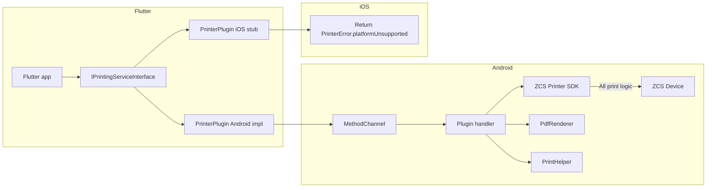

# Flutter plugin – ZCS Printer (+ PDF, system print, copies, interface, errors)

## Goal

Create a Flutter plugin that exposes **only the Printer** part of the ZCS/SmartPos SDK, with:

1. **Direct ZCS printing** – text, QR, barcode, bitmap, label, cutter, cash drawer. **All printing logic handled on SDK side** (Android native).
2. **Print copies** – ability to print N copies (direct, PDF, system print); optional **cut after every copy** when device supports cutter.
3. **PDF printing** – `printPdf(Uint8List bytes)` only; render PDF to bitmaps and print on ZCS.
4. **System print** – Android PrintHelper with **copies and cut support** (dialog: printer or Save as PDF).
5. **Dart interface** – `IPrintingServiceInterface`; Android = real implementation, **iOS = custom error/failure** (platform not supported).
6. **Custom error handler** – plugin-specific error type with **clear, user-facing messages** (generic name, not SDK-specific).

---

## Architecture




- **Dart**: `IPrintingServiceInterface` defines all print methods; `PrinterPlugin` implements it. On `Platform.isAndroid` use real channel; on iOS return/throw `PrinterError` with code `platformUnsupported`.
- **Android**: Single MethodChannel handler; **all printing logic handled on SDK side** (ZCS SDK manages buffer, formatting, device communication). Plugin just passes commands and data to SDK.
- **iOS**: No native implementation; every method returns a **custom error** (e.g. `PrinterError.platformUnsupported` with clear message).

---

## 1. Interface: IPrintingServiceInterface

Define a Dart **abstract interface** that the plugin implements. This allows the app to depend on the interface and test or swap implementations.

**Location**: e.g. `lib/src/printing_service_interface.dart`.

### 1.1 Status / Capability Methods

```dart
/// Get current printer status
/// 
/// Returns: PrinterStatus enum indicating current printer state
/// 
/// Usage:
///   PrinterStatus status = await printer.getPrinterStatus();
///   if (status == PrinterStatus.ok) {
///     // Printer is ready
///   } else if (status == PrinterStatus.paperOut) {
///     // Handle paper out
///   }
/// 
/// PrinterStatus values:
///   - PrinterStatus.ok - Printer is ready and operational
///   - PrinterStatus.paperOut - Printer is out of paper
///   - PrinterStatus.error - Printer error occurred
///   - PrinterStatus.busy - Printer is busy processing
///   - PrinterStatus.offline - Printer is offline or not connected
Future<PrinterStatus> getPrinterStatus();

/// Check if device supports paper cutter
/// Returns: true if cutter is available, false otherwise
Future<bool> isSupportCutter();
```

**PrinterStatus enum** (defined in `lib/src/printer_status.dart`):

```dart
enum PrinterStatus {
  ok,        // Printer is ready (SDK_OK)
  paperOut,  // Out of paper (SDK_PRN_STATUS_PAPEROUT)
  error,     // General error
  busy,      // Printer is busy
  offline,   // Printer offline/not connected
}
```

### 1.2 Direct Print (Buffer) Methods

These methods **build a print buffer** on the SDK side. Nothing is printed until `startPrint()` is called.

```dart
/// Append text to print buffer
/// 
/// Usage: Call multiple times to build a document, then call startPrint() to execute.
/// Example: 
///   await printer.appendText("Header", format);
///   await printer.appendText("Body text", format);
///   await printer.startPrint();
/// 
/// [text] - The text string to print. Can contain newlines (\n) for line breaks.
/// [format] - Formatting options (textSize, alignment, style, font, custom font path).
///            Use PrnStrFormat class with properties:
///            - textSize: int (e.g. 24, 25, 30) - Font size
///            - alignment: String ("left", "center", "right") - Text alignment
///            - style: String ("normal", "bold") - Text style
///            - font: String ("sansSerif", "monospace", "custom") - Font family
///            - path: String? - Path to custom font file (only if font="custom")
/// 
/// Font path explanation:
///   When font="custom", provide the [path] parameter with one of:
///   
///   1. Asset path (for fonts bundled in app):
///      - Example: "fonts/CustomFont.ttf"
///      - Must be declared in pubspec.yaml under flutter/assets
///      - Plugin will load from app's asset bundle
///   
///   2. File system path (for fonts stored on device):
///      - Example: "/storage/emulated/0/Download/font.ttf"
///      - Must be accessible file path on Android device
///      - Use path_provider or similar to get valid file paths
///   
///   3. Asset path with subdirectory:
///      - Example: "font/Montserrat-Regular.ttf" (as used in demo)
///      - Asset must be in assets/font/ directory
///   
///   Note: If font is not "custom", path parameter is ignored.
///   Example with custom font from assets:
///     final format = PrnStrFormat(
///       textSize: 24,
///       font: "custom",
///       path: "fonts/MyFont.ttf",  // Asset path
///     );
Future<void> appendText(String text, PrnStrFormat format);

/// Append multiple strings in columns to print buffer
/// 
/// Usage: Print table rows with aligned columns.
/// Example:
///   await printer.appendStrings(
///     ["Item", "Qty", "Price"],
///     [2, 1, 1],  // Column width ratios
///     [format, format, rightFormat]
///   );
/// 
/// [texts] - List of strings, one per column
/// [columnWidths] - List of integers representing width ratios (e.g. [2, 1, 1] means first column is 2x wider)
/// [formats] - List of PrnStrFormat, one per column (can reuse same format for all)
Future<void> appendStrings(List<String> texts, List<int> columnWidths, List<PrnStrFormat> formats);

/// Append QR code to print buffer
/// 
/// Usage: Generate QR code from data string.
/// Example: await printer.appendQrCode("https://example.com", width: 200, height: 200);
/// 
/// [data] - String to encode as QR code (URL, text, etc.)
/// [width] - QR code width in pixels (default: 200)
/// [height] - QR code height in pixels (default: 200)
/// [alignment] - String ("left", "center", "right") - QR code alignment (default: "center")
Future<void> appendQrCode(String data, {int width = 200, int height = 200, String alignment = "center"});

/// Append barcode to print buffer
/// 
/// Usage: Print barcode (e.g. CODE_128, EAN13).
/// Example: await printer.appendBarcode("6922711079066", format: "CODE_128");
/// 
/// [data] - String to encode as barcode
/// [format] - String ("CODE_128", "EAN13", etc.) - Barcode format (default: "CODE_128")
/// [width] - Barcode width in pixels (default: 360)
/// [height] - Barcode height in pixels (default: 100)
/// [showText] - bool - Show human-readable text below barcode (default: true)
/// [alignment] - String ("left", "center", "right") - Barcode alignment (default: "center")
Future<void> appendBarcode(String data, {String format = "CODE_128", int width = 360, int height = 100, bool showText = true, String alignment = "center"});

/// Append bitmap image to print buffer
/// 
/// Usage: Print image from bytes or file path.
/// Example: await printer.appendBitmap(imageBytes);
/// 
/// [imageBytes] - Uint8List - Image bytes (PNG, JPEG, BMP supported)
/// OR
/// [imagePath] - String - Path to image file on device
/// [alignment] - String ("left", "center", "right") - Image alignment (default: "center")
/// 
/// Note: Only provide either imageBytes OR imagePath, not both.
Future<void> appendBitmap({Uint8List? imageBytes, String? imagePath, String alignment = "center"});
```

### 1.3 Execute Print (with copies and cut)

```dart
/// Execute print buffer - Print all content added via appendText/appendStrings/etc.
/// 
/// What it does:
/// - Sends all buffered content (text, QR, barcode, bitmap) to the printer
/// - Prints [copies] number of copies
/// - If [cutAfterEachCopy] is true and device supports cutter, cuts paper after each copy
/// - Clears the buffer after printing
/// 
/// Usage:
///   await printer.appendText("Receipt", format);
///   await printer.appendText("Total: \$10", format);
///   await printer.startPrint(copies: 2, cutAfterEachCopy: true);  // Print 2 copies, cut after each
/// 
/// [copies] - Number of copies to print (default: 1, minimum: 1)
/// [cutAfterEachCopy] - If true and device supports cutter, cut paper after each copy (default: false)
/// 
/// Returns: bool - true if print was successful, false if failed
/// 
/// Throws: PrinterError if printer is unavailable, paper out, or other error occurs
/// 
/// Usage with error handling:
///   try {
///     bool success = await printer.startPrint(copies: 2, cutAfterEachCopy: true);
///     if (success) {
///       print("Print completed successfully");
///     }
///   } on PrinterError catch (e) {
///     print("Print failed: ${e.message}");
///   }
Future<bool> startPrint({int copies = 1, bool cutAfterEachCopy = false});
```

### 1.4 Cutter Methods

```dart
/// Cut paper immediately
/// 
/// Usage: Cut paper without printing (e.g. after manual feed).
/// If device does not support cutter, this is a no-op (no error).
Future<void> cutPaper();
```

### 1.5 Label Printing

```dart
/// Set printer to label mode
/// 
/// Usage: Switch printer to label paper mode before printLabel().
/// [paperType] - String ("label" or "label80mm") - Label paper type
Future<void> setPrintType(String paperType);

/// Set number of lines to feed for label paper
/// 
/// Usage: Feed label paper before/after printing.
/// [lines] - int - Number of lines to feed (default: 30)
Future<void> setPrintLine({int lines = 30});

/// Print label (bitmap image)
/// 
/// Usage: Print image on label paper.
/// Example: await printer.printLabel(labelImageBytes, copies: 3, cutAfterEachCopy: true);
/// 
/// [bitmapBytes] - Uint8List - Image bytes for label
/// [copies] - Number of copies to print (default: 1)
/// [cutAfterEachCopy] - If true and device supports cutter, cut after each copy (default: false)
Future<void> printLabel(Uint8List bitmapBytes, {int copies = 1, bool cutAfterEachCopy = false});
```

### 1.6 Cash Drawer

```dart
/// Open cash drawer
/// 
/// Usage: Trigger cash drawer to open.
Future<void> openCashDrawer();
```

### 1.7 PDF Printing

```dart
/// Print PDF document
/// 
/// Usage: Convert PDF to bitmaps and print each page on ZCS device.
/// Example: await printer.printPdf(pdfBytes, copies: 2, cutAfterEachCopy: true);
/// 
/// [pdfBytes] - Uint8List - PDF file bytes
/// [copies] - Number of copies to print (default: 1)
/// [cutAfterEachCopy] - If true and device supports cutter, cut after each full copy (default: false)
/// [cutBetweenPages] - If true and device supports cutter, cut between PDF pages (default: false)
/// 
/// Returns: bool - true if print was successful, false if failed
/// 
/// Throws: PrinterError if PDF is invalid, printer unavailable, or other error occurs
/// 
/// Note: PDF is rendered page-by-page to bitmaps, then each bitmap is printed via SDK.
Future<bool> printPdf(Uint8List pdfBytes, {int copies = 1, bool cutAfterEachCopy = false, bool cutBetweenPages = false});
```

### 1.8 System Print (with copies and cut)

```dart
/// Print using Android system print dialog (any printer or Save as PDF)
/// 
/// Usage: Show system print dialog so user can choose printer or save as PDF.
/// Example: await printer.printWithSystem(imageBytes, copies: 2);
/// 
/// [imageBytes] - Uint8List - Image bytes (PNG, JPEG, BMP)
/// [copies] - Number of copies to print (default: 1)
/// [cutAfterEachCopy] - If true, attempt to cut after each copy (only works if system printer supports it; may be ignored) (default: false)
/// 
/// Returns: bool - true if print dialog was shown successfully, false if failed
/// 
/// Throws: PrinterError if image is invalid, printer unavailable, or other error occurs
/// 
/// Note: This uses Android PrintHelper, not ZCS SDK. User selects printer or "Save as PDF" in dialog.
/// Cut functionality depends on selected printer capabilities.
Future<bool> printWithSystem(Uint8List imageBytes, {int copies = 1, bool cutAfterEachCopy = false});
```

---

## 2. Print Copies and Cut After Every Copy

### 2.1 How Copies Work

- **Direct print (`startPrint`)**: After building buffer once with `appendText`/`appendStrings`/etc., SDK executes `setPrintStart()` **N times** (where N = copies). Each execution prints the same buffer content.
- **Label (`printLabel`)**: SDK prints the same bitmap N times in a loop.
- **PDF (`printPdf`)**: SDK renders PDF once, then prints all pages N times (full document copies).
- **System print (`printWithSystem`)**: Android PrintHelper handles copies via system dialog (user can set copies in dialog; plugin passes copies parameter to PrintHelper if supported).

### 2.2 Cut After Each Copy

- **cutAfterEachCopy**: After each copy, if `isSupportCutter()` returns true, SDK calls `openPrnCutter(1)`.
- If device does **not** support cutter, the flag is **ignored** (no error, no warning; cutter simply not called).
- Available in:
  - `startPrint({int copies, bool cutAfterEachCopy})`
  - `printLabel(..., {int copies, bool cutAfterEachCopy})`
  - `printPdf(Uint8List pdfBytes, {int copies, bool cutAfterEachCopy, bool cutBetweenPages})`
  - `printWithSystem(Uint8List imageBytes, {int copies, bool cutAfterEachCopy})`

### 2.3 Cut Between PDF Pages

- **cutBetweenPages**: For PDF printing, if true and device supports cutter, SDK cuts paper between each PDF page (within a single copy). After all pages of a copy, if `cutAfterEachCopy` is also true, cuts again.

---

## 3. startPrint() Explanation

**What `startPrint()` does**:

1. **Executes the print buffer**: All content added via `appendText()`, `appendStrings()`, `appendQrCode()`, `appendBarcode()`, `appendBitmap()` is sent to the printer.
2. **Prints multiple copies**: If `copies > 1`, the same buffer content is printed N times.
3. **Cuts after each copy** (if requested and supported): After each copy, if `cutAfterEachCopy = true` and device supports cutter, paper is cut.
4. **Clears the buffer**: After printing completes, the buffer is cleared (ready for next document).

**Why separate buffer and execute**:

- Allows building complex documents (multiple text lines, QR codes, images) before printing.
- More efficient: build once, print multiple copies.
- Matches ZCS SDK design: `setPrintAppend`* methods build buffer, `setPrintStart()` executes.

**Usage pattern**:

```dart
// Build document
await printer.appendText("Receipt #123", headerFormat);
await printer.appendText("Date: 2025-01-15", normalFormat);
await printer.appendQrCode("https://example.com/receipt/123");
await printer.appendText("Total: \$50.00", boldFormat);

// Execute (print 2 copies, cut after each)
await printer.startPrint(copies: 2, cutAfterEachCopy: true);
```

---

## 4. PDF: printPdf(Uint8List bytes)

- **Dart API**: `printPdf(Uint8List pdfBytes, {int copies = 1, bool cutAfterEachCopy = false, bool cutBetweenPages = false})`.
- **Android**: Receive bytes, create `ParcelFileDescriptor` from memory (temp file or pipe), open with `PdfRenderer`, for each page render to `Bitmap` (scale to printer width, e.g. 384px), append to ZCS buffer and `setPrintStart()`; if `cutBetweenPages`, call cutter between pages. Repeat entire document for `copies`; if `cutAfterEachCopy`, cut after each full copy.
- **iOS**: Throw/return `PrinterError.platformUnsupported` with message that PDF print is Android-only.

---

## 5. System Print (with copies and cut)

- **Dart API**: `printWithSystem(Uint8List imageBytes, {int copies = 1, bool cutAfterEachCopy = false})`.
- **Android**: Decode bytes to `Bitmap`, use `PrintHelper.setScaleMode(SCALE_MODE_FIT)`, call `PrintHelper.printBitmap(...)` with copies parameter (if PrintHelper API supports it; otherwise user sets copies in dialog). Cut functionality depends on selected printer; plugin attempts to pass cut preference but may be ignored by system printer.
- **iOS**: Throw/return `PrinterError.platformUnsupported` with message that system print is Android-only.

---

## 6. Custom Error Handler (Generic Name)

Introduce a **plugin-specific error type** with a **generic name** (not SDK-specific like "ZcsPrinterError").

**Class**: `PrinterError` (in `lib/src/printer_error.dart`).

- **Fields**:
  - `code` – enum or string (e.g. `platformUnsupported`, `printerNotAvailable`, `paperOut`, `invalidPdf`, `invalidImage`, `invalidArgument`, `bufferEmpty`, `unknown`).
  - `message` – **short, clear, user-facing** string (e.g. "Printer is not available. Please check the device connection.").
  - Optional: `details` (platform message or stack) for debugging only; do not show directly to end users.

**Predefined messages (examples)**:


| Code                  | Example user message                                                                       |
| --------------------- | ------------------------------------------------------------------------------------------ |
| `platformUnsupported` | "Printer is not supported on this device. This feature is available only on Android."      |
| `printerNotAvailable` | "Printer is not available. Please check that the device is connected and powered on."      |
| `paperOut`            | "Printer is out of paper. Please add paper and try again."                                 |
| `invalidPdf`          | "The PDF could not be read. It may be damaged or in an unsupported format."                |
| `invalidImage`        | "The image could not be printed. Please check the file format and try again."              |
| `invalidArgument`     | "Invalid input provided. Please check your parameters (e.g. copies must be at least 1)."   |
| `bufferEmpty`         | "Nothing to print. Please add content using appendText or other append methods first."     |
| `cutterNotSupported`  | "This device does not support cutting. Cut option was ignored." (optional; can be warning) |
| `unknown`             | "An unexpected error occurred. Please try again."                                          |


**Usage**:

- All interface methods that can fail **throw** `PrinterError` (simpler in Dart than Result types).
- **Android**: Map SDK result codes (e.g. `SdkResult.SDK_PRN_STATUS_PAPEROUT`) and exceptions (e.g. PDF render failure, empty buffer) to `PrinterError` with appropriate code and message; send structured error over channel (e.g. `{ "code": "paperOut", "message": "..." }`).
- **iOS**: Every method throws `PrinterError.platformUnsupported` with the message above.
- **Dart**: Parse channel error and construct `PrinterError` so the app can show `error.message` to the user and use `error.code` for logic.

---

## 7. Reusable Code Design for Developers

The plugin is designed to be **easy to use and reusable** as a package. Key design principles:

### 7.1 Clear API with Type Safety

- **Enums instead of magic numbers**: `PrinterStatus` enum instead of int codes makes code more readable and type-safe.
- **Bool returns for success/failure**: Methods like `startPrint()` return `bool` for clear success/failure indication.
- **Optional named parameters**: All optional parameters use named parameters with sensible defaults, reducing boilerplate.

### 7.2 Builder Pattern Support

Developers can build print documents incrementally:

```dart
// Reusable receipt builder pattern
class ReceiptBuilder {
  final IPrintingServiceInterface printer;
  
  ReceiptBuilder(this.printer);
  
  Future<void> buildReceipt(Map<String, dynamic> data) async {
    final headerFormat = PrnStrFormat(textSize: 30, alignment: "center", style: "bold");
    final normalFormat = PrnStrFormat(textSize: 24, alignment: "left");
    
    await printer.appendText(data['header'], headerFormat);
    await printer.appendText("Date: ${data['date']}", normalFormat);
    await printer.appendStrings(
      ["Item", "Qty", "Price"],
      [2, 1, 1],
      [normalFormat, normalFormat, normalFormat]
    );
    // ... more content
  }
  
  Future<bool> print({int copies = 1, bool cut = false}) async {
    return await printer.startPrint(copies: copies, cutAfterEachCopy: cut);
  }
}
```

### 7.3 Error Handling Pattern

Consistent error handling across all methods:

```dart
// Reusable error handler
Future<void> safePrint(Future<bool> Function() printFunction) async {
  try {
    PrinterStatus status = await printer.getPrinterStatus();
    if (status != PrinterStatus.ok) {
      throw PrinterError(
        code: PrinterErrorCode.printerNotAvailable,
        message: "Printer is not ready. Status: $status"
      );
    }
    
    bool success = await printFunction();
    if (!success) {
      throw PrinterError(
        code: PrinterErrorCode.unknown,
        message: "Print operation failed"
      );
    }
  } on PrinterError catch (e) {
    // Handle printer-specific errors
    showErrorToUser(e.message);
  } catch (e) {
    // Handle unexpected errors
    showErrorToUser("Unexpected error: $e");
  }
}

// Usage
await safePrint(() => printer.startPrint(copies: 2));
```

### 7.4 Format Helpers

Provide helper classes/functions for common formatting:

```dart
// Reusable format presets
class PrintFormats {
  static PrnStrFormat get header => PrnStrFormat(
    textSize: 30,
    alignment: "center",
    style: "bold",
    font: "sansSerif"
  );
  
  static PrnStrFormat get normal => PrnStrFormat(
    textSize: 24,
    alignment: "left",
    style: "normal",
    font: "sansSerif"
  );
  
  static PrnStrFormat get rightAligned => PrnStrFormat(
    textSize: 24,
    alignment: "right",
    style: "normal",
    font: "monospace"
  );
}

// Usage
await printer.appendText("Header", PrintFormats.header);
await printer.appendText("Body", PrintFormats.normal);
```

### 7.5 Document Templates

Encourage reusable document templates:

```dart
// Reusable receipt template
class ReceiptTemplate {
  final IPrintingServiceInterface printer;
  
  ReceiptTemplate(this.printer);
  
  Future<bool> printReceipt({
    required String businessName,
    required String receiptNumber,
    required List<Map<String, String>> items,
    required double total,
    int copies = 1,
    bool cutAfterCopy = true,
  }) async {
    try {
      // Build receipt
      await printer.appendText(businessName, PrintFormats.header);
      await printer.appendText("Receipt #$receiptNumber", PrintFormats.normal);
      // ... build items, totals, etc.
      
      // Execute print
      return await printer.startPrint(
        copies: copies,
        cutAfterEachCopy: cutAfterCopy
      );
    } on PrinterError catch (e) {
      // Log and rethrow
      print("Receipt print failed: ${e.message}");
      rethrow;
    }
  }
}
```

### 7.6 Package Structure for Reusability

- **Interface-based design**: Apps depend on `IPrintingServiceInterface`, making it easy to mock for testing or swap implementations.
- **Clear separation**: Error types, status enums, and format classes are separate, reusable modules.
- **Comprehensive documentation**: All public APIs have usage examples and parameter explanations.
- **Consistent patterns**: All print methods follow the same pattern (build buffer → execute), making the API predictable.

### 7.7 Best Practices for Package Users

Document recommended usage patterns:

1. **Always check printer status** before printing:

```dart
   PrinterStatus status = await printer.getPrinterStatus();
   if (status != PrinterStatus.ok) {
     // Handle error
   }
   

```

1. **Use try-catch** for error handling:

```dart
   try {
     await printer.startPrint();
   } on PrinterError catch (e) {
     // Handle printer errors
   }
   

```

1. **Reuse format objects** instead of creating new ones each time:

```dart
   final format = PrintFormats.normal; // Reuse
   await printer.appendText("Line 1", format);
   await printer.appendText("Line 2", format);
   

```

1. **Build complete documents** before calling `startPrint()`:

```dart
   // Good: Build all content first
   await printer.appendText("Header", format);
   await printer.appendText("Body", format);
   await printer.startPrint(); // Execute once
   
   // Avoid: Multiple startPrint calls
   await printer.appendText("Header", format);
   await printer.startPrint(); // Bad pattern
   await printer.appendText("Body", format);
   await printer.startPrint();
   

```

---

## 8. Plugin Structure

- **Package name**: `zcs_printing`.
- **Layout**:
  - `lib/zcs_printing.dart` – export (interface, plugin class, error, models like `PrnStrFormat`).
  - `lib/src/printing_service_interface.dart` – `IPrintingServiceInterface`.
  - `lib/src/printer_plugin.dart` – `PrinterPlugin` implements `IPrintingServiceInterface`; uses MethodChannel on Android, throws `PrinterError` on iOS.
  - `lib/src/printer_error.dart` – `PrinterError` (code + message + optional details).
  - `lib/src/printer_status.dart` – `PrinterStatus` enum (ok, paperOut, error, busy, offline).
  - `lib/src/prn_str_format.dart` – `PrnStrFormat` with `toMap()`.
  - `lib/src/print_formats.dart` – Optional helper class with common format presets (for reusability).
  - `android/` – Kotlin handler; **all printing logic handled on SDK side** (ZCS SDK manages buffer, formatting, device communication); plugin passes commands/data to SDK. Also handles PDF rendering and PrintHelper. Map all failures to error codes/messages and send to Dart.
  - `ios/` – Stub only: register plugin but in Dart side short-circuit and never call platform; or call channel and return error from iOS. Simplest: **no native iOS code**; in Dart, if `!Platform.isAndroid` then throw `PrinterError.platformUnsupported` before invoking channel.

---

## 8. Implementation Summary (Checklist)

1. **Create plugin** – `flutter create --template=plugin --platforms=android,ios zcs_printing` in `/Volumes/Work/projects/` directory (iOS for stub/error only).
2. **Dart – Interface and error**:
  - Add `IPrintingServiceInterface` with all methods:
    - `getPrinterStatus()` → returns `PrinterStatus` enum (not int)
    - `isSupportCutter()` → returns bool
    - `appendText()` with detailed docs including font path explanation (assets vs file paths)
    - `appendStrings()`, `appendQrCode()`, `appendBarcode()`, `appendBitmap()` with docs
    - `startPrint(copies, cutAfterEachCopy)` → returns `bool` (not int), with error handling docs
    - `cutPaper()`, `setPrintType()`, `setPrintLine()`, `printLabel()`, `openCashDrawer()`
    - `printPdf()` → returns `bool` (not int)
    - `printWithSystem()` → returns `bool` (not int)
  - Add `PrinterStatus` enum (ok, paperOut, error, busy, offline).
  - Add `PrinterError` (code, message, details) and predefined codes/messages.
  - Add `PrnStrFormat` and serialization to Map.
  - Add reusable helper classes (PrintFormats, ReceiptTemplate examples) for developer convenience.
3. **Dart – Plugin implementation**:
  - `PrinterPlugin` implements `IPrintingServiceInterface`.
  - If `!Platform.isAndroid`: for every method, throw `PrinterError.platformUnsupported` (clear message). Else: call MethodChannel, parse result; on platform error, parse map and throw `PrinterError` with user message.
4. **Android**:
  - **All printing logic handled on SDK side**: Plugin passes commands/data to ZCS SDK; SDK manages buffer, formatting, device communication.
  - Implement all direct printer APIs (appendText, appendStrings, appendQrCode, appendBarcode, appendBitmap → SDK buffer; startPrint(copies, cutAfterEachCopy) → SDK executes buffer N times with optional cut), cutPaper, setPrintType, setPrintLine, printLabel(copies, cutAfterEachCopy), openCashDrawer.
  - Implement `printPdf(Uint8List bytes, copies, cutAfterEachCopy, cutBetweenPages)`: render PDF to bitmaps, send each to SDK buffer, execute with copies/cut logic.
  - Implement `printWithSystem(Uint8List imageBytes, copies, cutAfterEachCopy)`: decode image, use PrintHelper with copies parameter.
  - **Map SDK status codes to PrinterStatus enum**: Convert `SdkResult.SDK_OK` → `PrinterStatus.ok`, `SDK_PRN_STATUS_PAPEROUT` → `PrinterStatus.paperOut`, etc. Send enum name as string over channel, Dart converts back to enum.
  - **Return bool for print methods**: `startPrint()`, `printPdf()`, `printWithSystem()` return `true` on success, `false` on failure (map SDK success codes to true, errors to false).
  - Map SDK and system exceptions to error codes; return `{ "code": "...", "message": "..." }` so Dart can build `PrinterError`.
5. **iOS**:
  - No ZCS logic. Either no native call (Dart checks platform and throws) or iOS method channel returns error map `platformUnsupported` so Dart throws `PrinterError.platformUnsupported`.
6. **README** – Document:
  - Interface usage with examples
  - Error handling (`PrinterError`) patterns
  - iOS returns platform unsupported
  - Copies and cut options
  - `printPdf(Uint8List bytes)` and `printWithSystem` with copies/cut
  - All printing logic handled on SDK side
  - Reusable code patterns (builder pattern, format helpers, templates)
  - Best practices for package users

---

## 9. Deliverables

1. **Flutter plugin** `zcs_printing` with Dart interface and Android implementation.
2. **IPrintingServiceInterface** – all print-related methods with **detailed parameter documentation** showing usage and variable usage.
3. **Print copies** – `startPrint`, `printLabel`, `printPdf`, `printWithSystem` support `copies`; **cut after every copy** when `cutAfterEachCopy` is true and device supports cutter.
4. **startPrint() explanation** – clear documentation of what it does (executes buffer, prints copies, cuts, clears buffer).
5. **printPdf(Uint8List bytes)** – only bytes; options: copies, cutAfterEachCopy, cutBetweenPages.
6. **System print** – `printWithSystem(bytes, copies, cutAfterEachCopy)` (Android only).
7. **PrinterError** – custom error with codes and **clear user-facing messages**; generic name (not SDK-specific); used on both Android (mapped from SDK/OS) and iOS (platformUnsupported).
8. **iOS** – no ZCS implementation; all methods throw **custom error** (platform not supported) with clear message.
9. **All printing logic on SDK side** – Android plugin passes commands/data to ZCS SDK; SDK handles buffer management, formatting, device communication.
10. **README** – setup, interface, error handling, and API summary.

